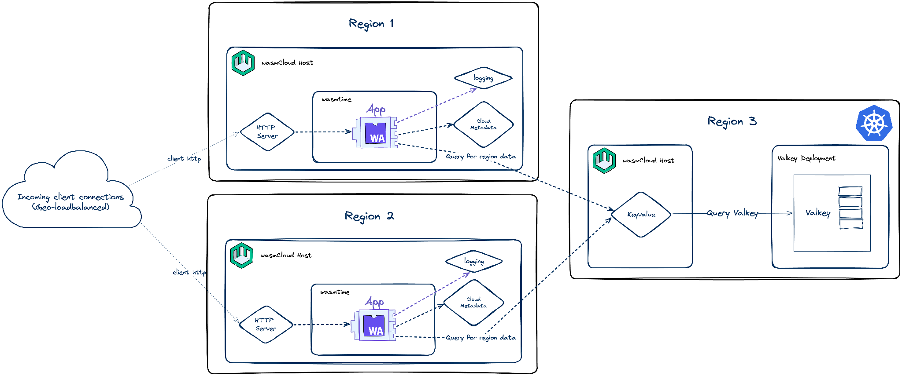

# Resilency on wasmCloud Demo

This demo shows an example of a resilient application built on wasmCloud.

## Overview



The demo consists of a wasmCloud application running on Fly.io that
communicates with a Valkey key-value store running on a Kubernetes cluster
running somewhere else. The application consists of a single component and two
capability providers:

### cloud-hello Component

The cloud-hello component does the bulk of the work in the application. It is
responsible for generating a webpage that is served to the caller, long with
incrementing counters tracking the number of visits to the region it is running
in and information contained in the user's browser.

### fly-io-metadata Capability Provider

The fly-io-metadata capability provider is responsible for providing regional
metadata for the Fly.io region the cloud-hello component is running in. This is
used to demonstrate wasmCloud's ability to run components and providers in a
distributed fashion. This is a custom capability provider that implements a WIT
interface [defined in this repository](/cloud-metadata).

### httpserver Capability Provider

The httpserver capability provider is responsible for handling incoming HTTP
requests and relaying them to the cloud hello component.

### Redis Key-Value Capability Provider

The keyvalue capability provider is responsible for storing and retrieving
information about vists to a deploy of the cloud-hello component running in a
Fly.io region. As deployed in our demo this indended to run in a Kubernetes
cluster to demonstrate wasmCloud's ability to run components and providers in
Kubernetes.

### kind-metadata Capability Provider

The kind-metadata capability provider is a custom capability provider that
implements the same cloud-metadata WIT interface as the fly-io-metadata
capability provider. This provider is intended to run in a kind cluster to
provide a mocked version of the similar metadata that the fly-io-metadata
exposes for local development.

## Running the Demo

Requirements:

* A Fly.io account
  * The flyctl CLI tool installed and authenticated
* A Kubernetes cluster running in a separate region. This could be a kind
  cluster running locally or in a cloud provider.
  * This should have the wasmCloud operator installed with at least one host
    configured. See
    [here](https://github.com/wasmCloud/wasmcloud-operator?tab=readme-ov-file#deploying-the-operator)
    for instructions.
  * If running on a cloud provider, the NATS cluster should be provisioned with
    TLS enabled along with an operator hierarchy.

1. Deploy the Valkey Key-Value Store

```sh
kubectl kustomize build deploy/k8s | kubectl apply -f -
```

2. Create a new Fly.io application:

```sh
cd machine
fly app create $APPNAME
```

3. Write a configuration file for the Fly.io application:

```toml
app = $APPNAME
primary_region = 'iad'

[build]

[http_service]
  internal_port = 8080
  force_https = true
  # Change this if you want your demo to only respond on demand
  auto_stop_machines = false
  auto_start_machines = true
  min_machines_running = 0
  processes = ['app']

[[vm]]
  memory = '4gb'
  cpu_kind = 'shared'
  cpus = 2
```

4. Deploy the Fly.io application:

```sh
cd deploy/fly
fly deploy --region iad -a $APPNAME -e WASMCLOUD_LATTICE=default -e NATS_ADDR=$ADDRESS_OF_YOUR_NATS_CLUSTER
```

5. Deploy the wadm manifest

```sh
wash app put wadm.yaml
wash app deploy resiliency-demo
```

6. Visit the application in your browser. Navigate to `$APPNAME.fly.dev` to see the
   application in action!

7. Refresh the page and see the region counters increase.

8. Once you're ready, take out a region and see it seamlessly failover.

### What's happening?


1. HTTP Client makes a request
1. HTTP Server Provider sends request to App Component
1. Component gets Cloud Metadata info from Custom Interface and Provider
1. Component queries the linked Keyvalue store for region data
1. Keyvalue provider queries configured Valkey store
1. Component generates and serves webpage
